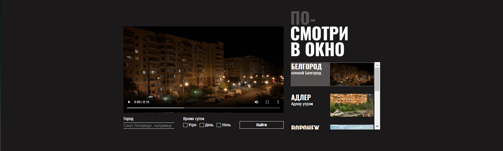

<h1 align="center">Посмотри в окно</h1>
<h1 align="center"></h1> 

## «Посмотри в окно» — сервис, который открывает двери в мир разных городов и их уникальных пейзажей!

## Описание

**Главный блок: Погружение**
На главном блоке демонстрируется видео из одного из городов мира. Это не просто статичное изображение, а живое видео, которое перенесёт вас прямо на улицы далёких уголков планеты.

**Карточки видео: Легкий доступ к разным записям**
В правой части экрана, под названием сервиса, представлен список загруженных видео с внешнего источника. Эти 5 видеокарточек, расположенные в удобной форме, предлагаются на выбор множество городов и видов. Каждая карточка представляет собой миниатюрное изображение видео, которое можно легко просмотреть. Просто нажмите на любую карточку, и текущее видео в главном блоке мгновенно сменится на выбранное вами. Эта функция позволяет быстро переключаться между различными городами и ландшафтами, обеспечивая максимальную гибкость в управлении контентом.

**Подгрузка дополнительных карточек**
После последней карточки есть кнопка для загрузки дополнительных видеокарточек. С нажатием эта кнопка расширяет коллекцию видео, позволяя исследовать новые города и виды, которые раньше были недоступны. Таким образом, можно продолжать своё путешествие, открывая для себя всё новые и новые места.

**Форма поиска: Индивидуальный подход к вашему запросу**
Под главным экраном находится удобная форма поиска, которая позволяет найти конкретное видео по запросу. Достаточно ввести название нужного города в поле ввода, а затем выберать время суток, когда была сделана запись, с помощью флажков. Нажав на кнопку «Найти», и приложение немедленно начнёт обработку запроса, перерисовав страницу с новыми данными. Если найдено несколько подходящих видео, они будут автоматически отображены в правой части экрана, чтобыможно выбрать из нескольких вариантов.

**Обработка ошибок: Безопасность и надежность**
Иногда могут возникать проблемы с загрузкой данных. Поэтому в случае ошибок вместо блока с видео автоматически подставляется блок с сообщением об ошибке, информирующий вас о том, что произошло. Это гарантирует, что пользователь всегда будет знать, что происходит, и сможет принять соответствующие меры.

**Прелоадеры: Увлекательная анимация процесса**
Во время загрузки данных на экране отображаются прелоадеры, создающие анимацию процесса загрузки. Эти эффекты не только делают ожидание более приятным, но и дают понять, что приложение активно работает и скоро предоставит вам результаты.

«Посмотри в окно» — это своего рода ваш путеводитель по миру, который позволяет исследовать новые города и ландшафты, не выходя из дома!
### Функциональные возможности

- **Загрузка данных:** При загрузке страницы скрипт получает данные из внешнего источника.
- **Отрисовка карточек:** Отображение пяти карточек с видео и кнопки для подгрузки дополнительных карточек.
- **Переключение видео:** Клик по карточкам переключает текущее видео в зависимости от выбранной карточки.
- **Обработка формы:** После отправки формы производится поиск совпадений по введённым параметрам и перерисовка страницы с новыми данными.
- **Обработка ошибок:** В случае ошибок на место блока с видео подставляется блок с сообщением об ошибке.
- **Прелоадеры:** Прелоадеры для анимации процесса загрузки.

## Используемые технологии

| Технология | Описание |
|------------|----------|
| Bash       | Для автоматизации задач. |
| Git        | Система контроля версий. |
| Grid Layout | Создание адаптивного макета. |
| Позиционирование | Статическое, относительное, абсолютное, z-index, фиксированное и «липкое». |
| Outline    | Управление внешней границей элементов. |
| Стилизация | Полей ввода, кнопок и ярлыков. |
| Псевдоклассы | Валидация, выпадающие списки, кастомные элементы ввода. |
| LVHA       | Правила для управления стилями. |
| Фокусы     | Обеспечение доступности. |
| Pseudo-elements | ::marker, ::selection. |
| Скринридеры | Поддержка пользователей с ограниченными возможностями. |
| a11y       | Базовые правила доступности. |
| Дерево доступности | Понимание и использование. |
| Изображения и видео | Декоративные и контентные. |
| Поля форм   | Обработка данных. |
| ARIA       | Улучшение доступности интерфейса. |
| Настройки | Уменьшение движения и повышение контрастности. |

<a href="https://aliskaincodeland.github.io/posmotri_v_okno/">Откройте в вашем браузере</a>
